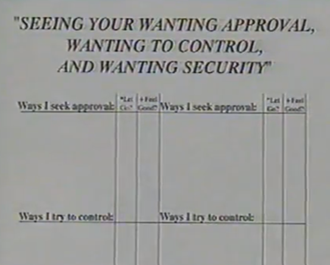
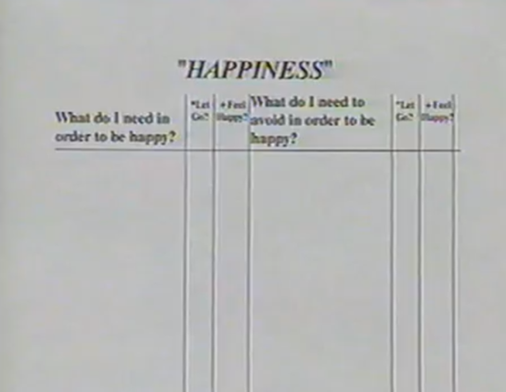
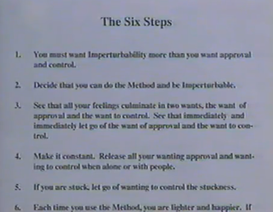

# 1992 Release Technique, Volume 8

## Gains

(00:00:27)

**Debra (Graduate 1991):** Well, for me, personally, I'd have to say the biggest gain was that I stopped putting things up. It's been eight weeks since I took the course. I wanted to lose 15 pounds. I did it. It's gone. I wanted to join a gym. I did it. I've been working out. Feels great. Those business calls that you feel intimidated about, get rid of the intimidation. You do it, financially, it comes back to you. Um, not wanting to call my mother. No problem. Call her all the time. Just all the things that I want to golf. My teatime is 09:20 tomorrow.

Just things that you, you had blockages, or you get rid of those blockages, and you just go for it. So personally, that was a gain, and the rest of the gains just followed by getting rid of all the garbage that was in the way. So, it's really been a terrific two months.

**Hale:** One, 

**Debra:** Yeah, I'm amazed. 

## Explanation – Hale

(00:01:23)

**Hale:** Before we work on the next thing we'll be working on, let's review what we've accomplished up until this point.

So, take your, your large chart of emotions out for a minute, and we'll review the everything we've covered up until now.

So just to review what we've accomplished up until this point, we've come a long way. We started with just identifying whatever we were feeling in the moment, then tracing it to the root feeling like, like the apathy, the grief, the lust, the anger, the pride, or even the courageousness, acceptance, and peace. And as you saw, as you let go of a little bit of that feeling, you will letting go of a little bit of everything underneath it.

Then yesterday, and or the last couple of tapes, we focused on the wanting approval and wanting control.

And then we saw that the wanting approval, wanting control, was underlying or, all the, all the feelings. So, every time you let go of a little bit of the wanting approval or the wanting to control, you were letting go of everything underneath it.

Now we've added the wanting security or wanting survival. That's what's at the root of everything. If you let go of all of you wanting security or survival, you'll be completely imperturbable.

So, if you would take a moment and write on your chart the wanting security or survival right here, above where we have wanting approved on control in between imperturbability and those two little boxes. That will be a reminder to you that that is the root of all this.

(Please pause the videotape to add “wanting security/survival” to your large chart of emotions. Continue when you are ready.)

Now, just to take a step back for a moment, some of you may have been wondering where thinking fits into all this.

Well, the reason we don't focus a lot on thinking in this course is that thinking is all the way at the bottom. Every one of even the smaller individual feelings is made up of sometimes hundreds or thousands of thoughts.

So, every time that you let go of some of the wanting approval, control, or survival, not only letting go of all the feelings underneath it, but you also letting go of all the millions of thoughts. That's why a lot of you may have noticed already that as you release, your mind gets a lot quieter without you trying, trying to do anything about it.

And that's also why we don't encourage people to do positive thinking. There's nothing wrong with positive thinking. It's certainly much better than negative thinking. But I think you can start to see that if you're working all the way down here, you're going to be in trouble.

But if you're willing to start letting go of the three wants, your, your thinking is automatically going to get a lot more positive, and the results you'll see in your life will be very dramatic.

## Worksheet “SEEING YOUR WANTING APPROVAL, WANTING TO CONTROL, AND WANTING SECURITY”

00:04:22

**Hale:** So, let's continue by working on the next release-sheet. Turn to the page in your book that says, “seeing your wanting approval, wanting to control and wanting security.” It should be the next page in your workbook.

Now, this sheet can be a lot of fun, because the purpose of the sheet is to start to show you how to see your wanting approval, wanting to control, and wanting survival when it's in operation, once you start to recognize it, and makes it easier and easier to start letting it go.

If you don't see it, it's hard to let go of it, but once you see it, you can start letting it go. So, what I'd like you to do is take a few moments and list the ways that you seek approval, try to control, and seek security.

And when you completed that, we'll start again.

(Please pause the videotape and write down ways you seek approval, ways you try to control, and ways you seek security. Continue when you are ready.)

Before we get started, I just want to remind you at home, and you hear, there's nothing wrong with anything that you put down on this list. Just because you put it down doesn't mean you have to stop doing it.

I mean, one of the ways most of us seek approval is by giving gifts. That doesn't mean you have to stop giving gifts, or it means is it If you're about to give a gift, check to see which want is stirred up. If you release it first, maybe you'll give a different gift. Maybe you won't give someone. So, you may have someone on your gift list that you really don't want to give a gift to. You're just wanting their approval. And you give it to them every year, might save you little money. (laugh)

So, you'll see that as you start to let go of the wanting approval, wanting to control, it doesn't necessarily mean you have to modify your behavior. All you'll be doing is freeing yourself from the compulsion they have to do some of these things, so you have more of a choice.

So, who'd like to start? And we'll go around, we'll work on one of each.

## Cases

**Hale/Cheryl (00:06:22)**

**Hale:** Is that a volunteer? Okay, great. (laugh)

**Cheryl:** Um. Seek approval. Be nice. 

**Hale:** Be nice? 

**Cheryl:** Guys like you have to be nice. (Laugh)

**Hale:** A lot of people feel that way. Okay, and which? Uh, which want is that stirs up, right now? Approval?

**Cheryl:** Yeah. 

**Hale:** I'll be quiet and just let you release it.

**Cheryl:** Okay, (Laugh) okay, 

**Hale:** what about control? 

**Cheryl:** Um, I can get real irritated or just be real cold to somebody, and I think it's a way of trying to get them to come over to my way of thinking, 

**Hale:** sure. Okay. And does that stir up the wanting to control as you talk about it?

**Cheryl:** Yeah. 

**Hale:** Are you ready to go? (Laugh)

**Cheryl:** Yeah, that’s a pretty dumb one. (Laugh) It doesn't work. (Laugh)

**Hale:** No. No. One said these things worked. (Laugh)

**Cheryl:** Okay. The other one? 

**Hale:** yes. And what…… 

**Cheryl:** um, having money in the bank.

**Hale:** Okay? That's one of the ways you try to get security. Yes. Okay. And as you talk about it, can you get a sense of that wanting security?

**Cheryl:** Yeah, some of it went away. 

**Hale:** So, you're holding on to something, right?

**Cheryl:** Yeah

**Hale:** Okay. And are you wanting to control your security?

**Cheryl:** Yes, (Laugh)

**Hale:** there it goes. 

**Cheryl:** Okay, 

**Hale:** Did you let it go?	

**Cheryl:** Yeah, I do.

**Hale:** Okay, give yourself some checks all around.

**Cheryl:** Okay, thank you.

---
**Rodney/Hale (00:08:09)**

**Hale:** So, who think are next? Rodney.

**Rodney:** I’ve got one on there.

**Hale:** We'll start with the top. Start with people. 

**Rodney:** The same serves that was being nice. 

**Hale:** Oh, okay. I had a second online. Was paying taxes, 

**Hale:** paying taxes.

**Rodney:** And that's the way you try to get approval, 

**Rodney:** In effect. So, the irs won't be on my case (Not clear).

**Hale:** Okay. (Laugh) Some people do that for security too. (Laugh)

**Rodney:** That could be true too.

**Hale:** Yeah. Okay, but are you aware of any…… of which want are you aware of in the moment as you talk about?

**Rodney:** Probably being, being oh approval.

**Hale:** Approval? 

**Rodney:** Definitely. 

**Hale:** Okay. I'll be quiet once you release it, 

**Rodney:** Okay, it feels better.

**Hale:** OK. What about the control?

**Rodney:** Control side by trying hard at what I do to control desired outcome, sometimes I try too hard. I overcompensate. Look forth more energy than I really need to.

**Hale:** Sure. Okay. And are you aware of any of the wanting that control right now?

**Rodney:** Yes, yeah. It's a little bit chronic in my personality. I need to get rid of.

**Hale:** Okay, so just allow yourself to become aware of the wanting to control. Did you let it go? 

**Rodney:** Most of it.

**Hale:** I'll say, saving some. Okay, 

**Rodney:** Little bit. 

**Hale:** Okay. And is that more the wanting to control?

**Rodney:** Yes.

**Hale:** Did you let it go? 

**Rodney:** Releasing. 

**Hale:** Good. Terrific. And what about on the wanting security.

**Rodney:** I secured its at conserving my spending, 

**Hale:** Conserving your spending? Okay, and again.

**Rodney:** I'll put the social security taxes down there. (Laugh) The income tax is above. 

**Hale:** Okay, (Laugh) That's funny. Okay, so are you aware of any of the wanting security right now?

**Rodney:** Yes, that's better. That's an easier middle one for me.

**Hale:** Good. Terrific. All right. Good. 

---
**Michael/Hale (00:10:27)**

**Hale:** So, who else? Michael. So, let's start with the way that you seek approval.

**Michael:** Um, I get a paycheck. 

**Hale:** Get a paycheck? Okay, 

**Michael:** It's approval. 

**Hale:** Okay, are you releasing it?

**Michael:** Yeah. (Laugh)

**Hale:** As you can see, a lot of these can have more than one want attach to them. Sometimes you can put one thing on all three.

**Michael:** Okay, I feel good about that.

**Hale:** Okay, and what about on the control? Would you write down for a way that you seek control 

**Michael:** By thinking, or analysis. 

**Hale:** By thinking, or analysis? That's a big way for most of us.

**Michael:** (Laugh) It's approval. 

**Hale:** Okay, yeah. 

**Michael:** And this control too. 

**Hale:** Okay, are you letting them go?

**Hale:** Yeah, the approval went away. And, uh, control went way, 

**Hale:** Good, 

**Michael:** yeah, 

**Hale:** more checks. And what about the ways that you seek security. 

**Michael:** By hugs. Getting hugs. 

**Hale:** Okay, it feels good. (Laugh) What the hugs? (Laugh)Or the releasing?

**Michael:** All of the above.

**Hale:** I understand. Right? 

**Michael:** Right. (Not clear) 

**Hale:** Okay, good. Did you? Did you let go all of the wanting security?

**Michael:** Yeah great? 

**Hale:** Okay, great. (Laugh) Terrific. Who wants to go next?

---
**Mary/Hale (00:12:21)**

**Hale:** Mary? Let's start with the control.

**Mary:** The top one is approval. 

**Hale:** Oh, then let's start with approval. I'm not particular. 

**Mary:** Okay, um. Cooking for others, 

**Hale:** Cooking for others?

**Mary:** Okay, from that, I can let that go.

**Hale:** Good. I'm back in show. 

**Mary:** Um, getting clients to say yes. Closing, (Laugh) 

**Hale:** closing the deal, (Laugh) Right. 

**Mary:** Boyfriend accuses me of aways doing.

**Hale:** You're closing all the time, right?

**Mary:** People to say yes to what I want.

**Hale:** Okay, now you aware of the wanting to control there?

**Mary:** Yeah.

**Hale:** I think you're letting it go.

**Mary:** Yeah.

**Hale:** Okay, and what about security? 

**Mary:** um, setting my alarm system in my house every time I go out. That gives me a feeling of security.

**Hale:** Okay, 

**Mary:** no, I can't let go of that. (Laugh) 

**Hale: Remember, not the action. There's nothing wrong with the action.**

I'll tell you an interesting story about that, although it'll probably start more of you wanting security. If you, if you ever noticed, very often, when there's one robbery in an area, all of a sudden there's a rash of robberies. It has nothing. It's not like all the robbers get to go and say, hey, let's hit this neighborhood. It has nothing to do with that. One person has a robbery. All the other neighbors get their wanting security start up. They're going, oh no, I hope that doesn't happen to me. What are they holding mind, it's going happen to me. Right. See? So, every time you turn on the alarm, if you don't release the wanting security, you're holding a mind, oh, I hope this will protect me from those robbers who are about to come in my house.

So, it's nothing, there's nothing wrong with turning on the alarm, but if you release each time, that's what's going to make your house safer than any warn system.

**Mary:** I just, I put the alarm on for good measure, just in case. Right. (Laugh)

**Hale:** I think there still want security. (Laugh)

**Hale:** You hear what I just said. I said, take the action. (Laugh)

**Mary:** Okay.

**Hale:** Let go of want security, which is what, do this ongoing every time you go to set the alarm, let go of wanting security.

**Mary:** Okay. 

**Hale:** Okay? 

---
**Chris/Hale (00:15:06)**

**Hale:** So, who else? 

**Chris:** Um, I'll give you mine.

**Hale:** Okay, great. Some of them are in common.

**Chris:** It seems the international language for approval is, is money. So, buying things for others, buying things together. And that was easy to let go because, um, we discussed it at lunch. When David bought me lunch, I gave him all the approval he needed. (laugh)

**Hale:** See it sometimes, (Laugh) see it sometimes works. (Laugh) That's funny. 

**Chris:** I even put a check for you. (Laugh) 

**Hale:** What about control.

**Chris:** Uh, control. Uh. Definitely intellectually manipulate and manipulate people.

**Hale:** Okay, 

**Chris:** that's probably bad. Um, yeah, 

**Hale:** wait, wait. What about the release? 

**Chris:** I'm definitely, I’m that wants a tough one that I've worked with before, as a matter of fact.

**Hale:** But right now, let's get a release to Right now, just allow yourself to become aware of the wanting to control.

**Chris:** Yeah, let that want go.

**Hale:** Good. 

**Hale:** Is there anymore? 

**Chris:** Yeah, there’s still a little bit there. 

**Hale:** Alright. Well, that's a lot of all the wanting to control that's there now.

**Hale:** Might as well let it all go. 

**Chris:** Feels much better.

**Hale:** Okay, good. What about the wanting security? 

**Chris:** Um, something that I looked in ways in which I do, and I found the most common thing that I think I do is isolate myself, you know, go home, um, if I'm away from all the people that I'm seeking approval from, and, and, well, maybe just other than myself, uh, I-I feel most secure when I'm away from all the external risks that are out there.

**Hale:** Sure, isolating. That's a big one for many people, especially today. Alright, so could you just allow yourself to become aware of the wanting security?

**Chris:** Definitely. Yeah. Let that go, too.

**Hale:** Good, terrific.

---
**Dave/Hale (00:17:19)**

**Hale:** Alright. Who else would like to do? Dave.

**Dave:** On approval, by volunteering or doing or giving? Uh, I think it's the ways that I tend to seek approval in many, many instances. 

**Hale:** Like at lunch. 

**Dave:** Exactly like at lunch, because under control I might add……

**Hale:** Wait. I mean, let’s get a release first. (Laugh) You want to hold on to that want. (Laugh) Now again, remember, there's nothing wrong with the behavior. But as you release, you'll have a choice. Sometimes you'll volunteer totally at a free choice, and you feel good about it. But right now, I'm sure there was a time to go you volunteered to go. I can't believe I just volunteered for that. (Laugh)

Why did I knew I shouldn't volunteer? So go back and see if you can just become aware of the wanting approval. W And remember, it doesn't mean you can’t volunteer. If you still want to.

**Dave:** Okay. I got in touch with that, let it go.

**Hale:** Good. Okay, now what about on the control? On the control, E.G (for example). Chris thought I was seeking approval. In fact, I was being very manipulate. Because I was trying to control him, because there's something I'm gonna have him do for me. So as a result, I was controlling. (Laugh)

**Hale:** So, what did you put down through manipulation?

**Dave:** Is able to manipulate people in an attempt to control?

**Hale:** Okay, 

**Dave:** And I'm embarrassed to say that, but it's true.

**Hale:** So, which want does it stirs up now? The wanting approval or the wanting to control?

**Dave:** Control.

**Hale:** Okay. Did you let it go? 

**Dave:** Okay. (Laugh) I let it go. (Laugh)

**Hale:** Good. Now, what about the, the security? What's some way you seek security?

**Dave:** Actually, working gives me a sense of security. As to that, I feel a financial freedom, I guess.

**Hale:** Okay, so you're aware of any the wanting security right now? MHM, I think I let that go.

**Hale:** Good. Terrific. 

**Dave:** Yeah. It was better. 

**Hale:** Right, you’re welcome. 

---
**Terry/Hale (00:19:50)**

**Hale:** Anyone else wanna do one? Did everyone do one yet? 

**Terry:** No, I’m, I’m left.

**Hale:** You’re left? Does that mean you wanna do one?

**Terry:** Yeah, I’ll do one.

**Hale:** Okay, great. So, let's start at the top. What's the one of the ways that you…... what's one of the ways that you seek approval?

**Terry:** Um, okay, so many here. Um. 

**Hale:** Just pick your favorite.

**Terry:** Okay, one of my favorites is to be perfect. I like that one. 

**Hale:** You like that one? (Laugh) Okay, it's another popular one. 

**Terry:** Yeah, chosen by many.

**Hale:** Are you aware the wanting approval?

**Terry:** Yes. Yeah, okay. 

**Hale:** Do you let it go?

**Terry:** Mhm Yeah. 

**Hale:** It's still somewhere? 

**Terry:** I kind of had to let go of wanting to let that go too. I'd kind of did that. 

**Hale:** I mean, the controller always do it.

**Terry:** Controlling. yeah. The control of the release.

**Hale:** Okay. Now, what about uncontrol? What’s…… it's one of the ways that you try to control, 

**Terry:** um, I correct people.

**Hale:** Correct people? Okay, 

**Terry:** yeah. If they make a mistake, they're not perfect.

**Hale:** Right. (Laugh) 

**Terry:** Make sure they know, 

**Hale:** Right. 

**Terry:** They're not perfect, I am. (Laugh)

**Hale:** Are you releasing the wanting to control? Good, 

**Terry:** yeah. Just, I mean, making this list is, uh, I could see this. I'm gonna be good, 

**Hale:** Right. By the way, I would definitely suggest that you continue going with it. Whatever you've written down so far, just keep going with it, because it's really an eye-opener. It will really help you start to undo a rather wanting approve and wanting control and the wanting security.

**Terry:** Right, you know.

**Hale:** What about speaking of security? 

**Terry:** Speaking of that? One of the ways that that I, then I think, one, one of the ways that I really feel secure, is it is, that's a good case in point, um, confusion. And that allows me to, not, I mean to, to not make a mistake.

**Hale:** Right, keeping yourself in confusion.

**Terry:** Okay, I keep it, yeah. And so I don't make a decision. I keep analyzing, I keep, you know, 

**Hale:** sure, again, that's, that's a real popular one. A lot of people, A lot of people hide in there.

**Terry:** Yes.

**Hale:** So just allow yourself to become aware of the wanting security.

**Terry:** OK. That’s good.

**Hale:** Did you let it go?

**Terry:** Yeah.

**Hale:** So, you let it all go?

**Terry:** No, (Laugh) I have to……

**Hale:** No, you don't have to. You can hold onto it as long as you want.

**Terry:** I may not survive if I let this go. (Laugh)

**Hale:** Now again, you can still choose to be confused, but it don't you notice how often you you're automatically just in a state of confusion, and you can't even get yourself out of it, 

**Terry:** Right.

**Hale:** Because it's just running. You don't have a choice. 

**Terry:** I mean, it's not a place I would consciously choose to be, but I think so consciously, somehow it's safe.

**Hale:** Well, seems safe. 

**Terry:** Seems safe. 

**Hale:** I don't know how safe it is to be confused, huh, 

**Terry:** Yeah.

**Hale:** But it seems safe.

**Terry:** And that’s why I’d like to let it go.

**Hale:** Alright. So just allow yourself to become aware of that wanting security. 

**Terry:** It's real hard to get in touch with that.

**Hale:** Yeah, you want to control it?

**Terry:** Yes.

**Hale:** Could you let that go? 

**Terry:** Yeah, I think a little bit.

**Hale:** A little bit? (Laugh) It's okay. This is a deep issue for you.

**Terry:** Now I’m wanting approval. 

**Hale:** Now you want to approve, are you releasing? or just wanting approval in general. 

**Terry:** Approval that I'm releasing from you. 

**Hale:** right.

**Terry:** Yeah. 

**Hale:** Could you allow that to release?

**Terry:** Yeah, 

**Hale:** Did you? 

**Terry:** Yeah, 

**Hale:** Okay. How’s it going?

**Terry:** I think I-I think it's gonna need some work. I think I feel better. 

**Hale:** Okay, well, you can keep going on your own. Sure, that's fine. Why don't you just keep going on your own?

**Hale:** I'll take you off the hook.

**Terry:** Will you?

**Hale:** Yes, I will. 

**Terry:** I must have released. (Laugh) I’ll write it to my gains. (可能) No, thanks.

**Hale:** Okay, good. Okay. Anyone else want to do another one? You want to just keep going on your own?

## Guidance – Hale

(00:25:06)

**Hale:** You can keep going as I'm working with the home-viewer.

So why don't we do some work together now? Start with something that you, way that you seek approval. 

Just allow yourself to focus on it. And just allow yourself to become aware of which want that stirs up in the moment as you focus on that.

Is it a wanting approval, or wanting control or wanting security?

Now, I'll just allow you to let it go. I know you can do it. 

Okay, now just check that same item again, that way, that way that you seek approval and see if there's any more want stirred up in the moment.

And whatever want it is, could you allow it to release?

OK. Now, let's take away that you try to control, which ever want you focusing on. Just allow the want to come up into your awareness, the wanting approval, wanting control, or wanting security. 

And as it comes into your awareness, see if you just keep letting it go. Sometimes it comes in waves, so as each wave comes up, just allow yourself to let it go.

Now, focus on that item again, just to check, see if there’s any more wanting approval, wanting control, or wanting security there right now.

And as you become aware of it, could you just allow it to release?

OK, now, let's focus on a way that you seek security or survival.

Now, as you focus on that item, see which you want it stirs up. Does it stir up the wanting security, or is it a wanting approval or wanting control?

And again, you can just use these pauses here for your own releasing.

Now focus on that item again, that way that you seek security or survival. 

Just see if you can allow that want to come into your awareness and then easily allow it to release.

Okay, now I suggest you keep going on your own. Take as long as you need to complete the sheet. And it's also a sheet you can keep coming back to, keep adding as you catch yourself, ah, this is the way I try to control, or ah, this is the way I seek approval. Write it down and release. And it's good to keep a running tab on this, because it will help you see clearly when you are wanting approval, wanting control, or wanting security or survival.

(Please pause the video tape and continue releasing. Make sure you write down your gains. Continue when you are ready.)

## Worksheet “HAPPINESS”

(00:29:21)
 

**Nikki:** So now we're going to work on our next release-sheet. So, turning your books to the page that says; “Happiness.”

What we're all looking for is to be happy. It's something that we all have in common. The bottom-line is that we want to be happy. And the fact is that we are very often looking for happiness in all the wrong places, and we wonder why we get disappointed.

What we're going to be doing on this worksheet is looking at what it is that you need in order to be happy, and also the other side, what it is that you need to avoid in order to be happy and exploring the wants that are connected there with that and letting those go.

So, I'm just going to give you a moment here to write down some of the things that you need in order to be happy, some of the things that you need to avoid in order to be happy.

Let's just take a moment to do that.

(Please pause the videotape and write down things you need in order to be happy, and things you need to avoid in order to be happy. Continue when you are ready.)

So, let's do some releasing on this sheet together now. And those of you at home, just release along as you're watching others release, focusing on the things that you've discovered for yourself and releasing the wants around that.

So, who would like to go first? Let's take a pair from each of you.

## Cases

**Nikki/Michael (00:30:52)**

**Nikki:** Michael, what is it that you need in order to be happy?

**Michael:** I need time. I need time to be happy.

**Nikki:** Oh, ok. And what want is there when you think about that?

**Michael:** Control.

**Nikki:** Okay, I’m just gonna give you a moment to release that yourself, Michael.

**Michael:** Okay. 

**Nikki:** Okay, alright (Laugh) . I wanted something that you need to avoid in order to be happy.

**Michael:** Traffic.

**Nikki:** (Laugh) Ok. What? What want does that stir up?

**Michael:** Control.

**Nikki:** Alright. 

**Michael:** Okay, now, that's good. That feels good. 

**Nikki:** Okay, good. Just carry on working on your own on this list, taking each thing. Give yourself a couple of checks there.

Nikki/Rodney (00:32:03)

**Nikki:** So, who’s next? Rodney, what do you need in order to be happy?

**Rodney:** To do what I want to do

**Nikki:** Okay? And which want is connected with that?

**Nikki:** The wanting approval? 

**Rodney:** Control.

**Nikki:** Okay? Allow yourself to focus on that. I'm just gonna let you release it. 

**Rodney:** Okay.

**Nikki:** Okay? Good. Alright? And on the other side, what is it that you need to avoid?

**Rodney:** Dead.

**Nikki:** Okay, (Laugh) which want gets stired up there?

**Rodney:** Security, partially. 

**Nikki:** Okay, so just allow yourself to be aware of the wanting security. 

**Nikki:** Okay. Okay. Good. I just wanted to say to you, and especially on the first one, in what you need in order to be happy, it's not that you shouldn't have those things. Again, it's just the wanting that's connected with that that you're letting go off. You should have that. That's wonderful. It's just the, the wanting and the conflict that gets stood up with that that we're letting go of. Okay, good. Thank you. 

---
**Nikki/Dave (00:33:28)**

**Nikki:** So, who’s next? Dave? 

**Dave:** Um.

**Nikki:** What is it that you need in order to be happy?

**Dave:** I think good relationships.

**Nikki:** OK. And what want is there in the moment about that?

**Dave:** Control.

**Nikki:** Alright. Okay.

**Dave:** I let that go.

**Nikki:** Good. What else? What do you need in order? What do you need to avoid in order to be happy?

**Dave:** Well. Obviously, poor relationship, but I think a lack of financial freedom would. This important in that aspect, to me, probably. 

**Nikki:** Okay. And which want is underlying that? the approval or the control, or the security, survival.

**Dave:** Security.

**Nikki:** Okay.

**Dave:** I let that go. 

**Nikki:** Okay, great. 

**Dave:** Getting easier and easier all the time.

**Nikki:** Yeah, really does. Okay, so give yourself a couple of checks there, 

**Dave:** Thank you. 

**Nikki:** and just keep going with your list, focusing on whatever else you have there.

---
**Nikki/Cheryl (00:35:02)**

**Nikki:** So, who’s the next? Okay, Cheryl, so what's something that you need in order to be happy?

**Cheryl:** I need to release. 

**Nikki:** Okay. And what's the want connected there?

**Cheryl:** I think it’s control.

**Nikki:** Okay.

**Cheryl:** Okay.

**Nikki:** Did you let it go? (Laugh) And on the other side, what is it that you need to avoid?

**Cheryl:** Feeling like I have no money.

**Nikki:** Okay. And what want does that stir up?

**Cheryl:** I think that's security. But. It's like it just started and then it's like, boom, not going anywhere. (Laugh)

**Nikki:** You’re wanting to control your security? Okay.

**Cheryl:** Okay,

**Nikki:** Just go back to it and check see if there's any more wanting security.

**Cheryl:** It's like it's still going. It feels really good.

**Nikki:** Okay, good. It’s just releasing. Wonderful. Okay. 

**Cheryl:** Thank you. 

**Nikki:** Thank you. 

---
**Nikki/Chris (00:36:07)**

**Nikki:** So, who else? 

**Chris:** I have some that I um, let go. Um. I put the first thing down, uh. What I need in order to be happy is self-approval.

**Nikki:** Oh, okay.

**Chris:** Um. And the moment I wrote it down, I had to let it go. It's all approval. 

**Nikki:** Alright. 

**Chris:** So, let that go. And, um, what I need to avoid, I put conflict. And no matter what aspect I'm looking at a personal relationship, working relationship, whatever conflict.

**Nikki:** Okay. What want does that stir up?

**Chris:** Um. Control. 

**Nikki:** Alright, 

**Chris:** yeah. I can let that go.

**Nikki:** Okay, good. Thanks. So, thank you. 

**Chris:** Thank you.

---
**Nikki/Terry (00:37:05)**

**Nikki:** Who’s next? 

**Terry:** Okay, what I need in order to be happy is independent.

**Nikki:** Oh, okay, 

**Terry:** And, just altogether. And I think that's security.

**Nikki:** Okay, so, just allow yourself to be aware of it.

**Terry:** Okay, 

**Nikki:** Okay, did you let it go? 

**Terry:** yeah. 

**Nikki:** Good.

**Terry:** Yeah.

**Nikki:** What is it that you need to avoid in order to be happy?

**Terry:** Um. One of the things that I that I think I need to avoid are people that abuse alcohol and drugs.

**Nikki:** Okay. And which want gets stirred up there?

**Terry:** Um, I think control is, is one that I feel, 

**Nikki:** I’m just gonna give you a moment to allow it to release.

**Terry:** I, after, I, you know what, I can feel that go. I think, um, survival, really. 

**Nikki:** Okay.

**Terry:** There's a lot of, 

**Nikki:** yeah. And just allow yourself to be aware of that at wanting survival. Just say, could you let it go?

**Terry:** Yeah.

**Nikki:** Okay, good. How is it that now?

**Terry:** It’s a lot better. 

**Nikki:** Good. 

**Terry:** Yeah.

**Nikki:** You can get yourself a couple of check here too. You know the bottom line is, as you continue letting go of your wants, you're just gonna get happier and happier. And so, when you've let go of them all, you're happy all of the time.

There is one other thing though, too, and that is, as I mentioned slightly earlier, we do have a tendency to look for our happiness in other people, other situations, work, money. And the fact is that really it's not there. Not that you shouldn't have those things, but the true happiness is really within you. It's inside of you all of the time.

And as you release, what you're going to be doing is uncovering that and letting that come through. You are naturally happy. It's just all the negativity and the wants that are on top of that. And as you let go, that's just gonna come through more and more and more.

So, look for the happiness inside of you. We think it's out there, and in fact, it's really right here. So, if you'll start looking and identifying with it being inside of you, you're just gonna move that much faster, too. But have all those wonderful things too.

## Guidance – Nikki

(00:40:23)

**Nikki:** OK. So, let's do some releasing now with our home-viewer, and follow along. Just continue writing on your list the things that you need in order to be happy and the things that you need to avoid, as I work with those at home.

So just pick something off of your sheet that you need in order to be happy. Something you feel you need. 

What's the underlying want connected with that one thing? Is it the wanting approval? The wanting to control? Or the wanting security, survival? 

Now that you're aware of it, I'm just going to be quiet and allow you to let it go.

Just check if there's any more of it there.

Did you let it go? 

Now, on the other side, find something that you need to avoid in order to be happy.

Just allow yourself to be aware of the want that's connected with that.

Just allow yourself to let it go.

Let's pick something else, something else that you need in order to be happy.

Whatever that thing is, just allow yourself to become aware of the want that's there with that.

Just allow yourself to release it.

And now on the other side, pick something else that you need to avoid in order to be happy.

Allow yourself to identify the want that's there about that.

I'll be quiet while you just let it go.

I'll let you continue on your own. You really don't need me here to I ask you the questions. You can just allow the want to come into your awareness and allow it to release. But you don't even really need to ask yourself the questions. Just allow yourself to focus on whatever want is there, and allow it to release.

And so, keep going until you've addressed the things on your list that you are wanting to avoid, and also that you feel you need in order to be happy, until you feel good.

So, take some extra time to do that, and when you've done that, take a break for yourself. Just to continue your releasing.

## Gains

(00:44:38)

**Mary:** When I first took the method, I was the first weekend I was very confused. I really didn't understand. I really wasn't in touch with a lot of my feelings, or didn't want to be. And, um, when they introduced wanting control and wanting approval, that confuse me even a little bit more. (Laugh)

But I kept using it. I released on little things that I could, and I waited to release on larger issues in my life. But I noticed amazing things happened the first week after I took the method. I mean, between the two weekends, I made a couple of sales, and some unexpected things happened that I never thought about. I mean, they just happened, and I didn't think I was getting it, but obviously I was getting it. And, um, I just continued with it, and by the second week, I understood it a lot, a lot better and a lot clearer.

(00:45:44)

**Rick (Graduate 1980):** The greatest benefit I've received from it has to do with my role as a father. I have five children, and raising children for me is the greatest challenge in my life, a lot tougher than business or anything else that I do. And I found that by being able to release, I'm able to be very supportive in loving to my children and still give them the discipline that they need.

So, it's enabled me to really find a balance as a parent, and also not have my life consumed by raising my children. I'm able to do a lot of other things as well.

## Write Gains for Us

(00:46:13)

**Nikki:** What we’re going to be doing now is, have you write some gains for us? There's a page in your book, the next page, along with its headed “gains.”

And as we're nearing the close of the class here, I just like to give you the opportunity to write down some of the gains that you've had.

So, we're going to take some time here. I'm going to give you some time to do this. It can be small gains; it can be large gains; it can be general gains, but gains that you feel that you have had from the class so far. In fact, those of you at home, I'd also like you to do this too. Take some time now and looking at Gains Book if you need to refresh your memory but write down some of those gains.

There's a couple of reasons for this. One of the reasons is, again, it will validate you for your progress. Another reason is I'd like you to send your gains into us. We really want to know how you're doing and hear your gains from taking the course. There's also another reason. When we receive your Gains Sheet, you are considered a graduate. You have finished the class, and you will automatically receive from us our newsletter. And you'll also automatically get to hear of anything else that we do. We have graduate get togethers at times, and you'll be notified of those things.

So, it's really important to us that you send those in so you can receive that information. Also, if you have other people who are doing the course with you, make sure that they send in their gains too, and that way they can have that information. OK. So, take the time now to write your gains, and don't forget to send them in to us.

(Please pause the videotape and write down your gains and benefits. Please mail them to us as soon as you complete this tape. Continue when you are ready.)

## Complete the Workbook

(00:48:09)

**Hale:** As you can see, we've really accomplished quite a bit up until this point. And there's a few more things I want to do with all of us here and those of you at home. But before we do that, I just have a couple of things to remind you about having to do with your special area of interest workbook.

First of all, please complete the book that you've started all the way through the last section. And if you want to, you can go back and complete the other two workbooks, the ones you haven't worked with yet, and take them all the way from the beginning all the way to the end.

But in the beginning last week, we were working with feelings, you don't need to go back to working with feelings. All you need to do is focus on the three wants and use the sheets to help bring up the three wants and let them go.

Turn to the page in your workbook that says “The Six Steps” at the top of it. It's right after the sheet that says “Gains.”

## The Six Steps:

(00:49:03)

 

1.	You must want Imperturbability more than you want approval and control.

2.	Decide that you can do the Method and be Imperturbable.

3.	See that all your feelings culminate in two wants, the want of approval and the want to control. See that immediately and immediately let go of the want of approval and the want to control.

4.	Make it constant. Release all your wanting approval and wanting to control when alone or with people.

5.	If you are stuck, let go of the wanting to control the stuckness.

6. Each time you use the Method, you are lighter and happier. If......

**Hale:** Now, the Six Steps are really a summation of everything we've been doing up until this point. The reason we bring them out at the very end is these would just be words up until this point, but we really covered it from many different angles, everything on the sheet.

Now, **the first step of the six steps is, “You must want imperturbability more than you want approval control or security.”** 

If you don't want the imperturbability, you're not going to release. And your wanting imperturbability is what enabled you to complete the tapes and also be here throughout the whole four days.

It's what a lot of people hear about this course. We, we, we're starting to be available now on television. There are radio commercials. We've done mailings where the word is really starting to get out. But only a small percentage of people really make the choice to go for their freedom. You are a special group of people. Those of you here taking the class and those of you at home, you're a special person because you are really wanting that imperturbability more than you wanting to just want, especially the three wants, the wanting approval, the wanting to control and the wanting security or survival.

Now, another way you can use Step 1 is very simple. You can ask yourself, if you're in the middle of a situation that you're really upset, say you're, you're having an argument with someone you care about, and you catch yourself really wanting their approval. **You can ask yourself, “Would I rather want this person's approval? Or would I rather be imperturbable?”**

If you ask yourself that question, it's an easy choice, of course. You'd rather be imperturbable than sit here wanting this person's approval. It's very uncomfortable. You can use that any time. Where you find you're getting a little stuck. You can just ask yourself; “What I, What would I rather have? Imperturbability or wanting?” And I think you choose the imperturbability.

Now, **Step 2 is, “Decide you can do the method and be imperturbable.”**

Now, that's something you're doing. Every time you use the method, you're making that decision, yes, I can release. Yes, I can let go. Yes, I can be imperturbable.

**Step 3 is really the essence of the method, is, “See that all your feelings culminate in just the three wants, the wanting approval, the wanting to control and the wanting security and survival. And see that immediately, no matter what you're doing, and immediately let go of the wanting security, the wanting survival, the wanting approval and wanting control.”**

As you do that, you'll develop a tremendous momentum. Which brings us to the next step, which is **Step 4, “Make its use constant. Use all situations, whether alone or with people.”**

Now, that's very important. If you make releasing constant, that's where you really start to see many benefits. So releasing is not just when you take time out. You can be releasing in the middle of a conversation. You can be releasing at your office, you can be releasing at home, you can be releasing while you're driving to work. No matter what you're doing, there are always wants coming up, and you can use those wants as an opportunity to get a lot freer.

Now, Step 5, “If you're stuck, let go of wanting to control the stuckness.”

Now, if you know this, Nikki and I have done that with you quite a bit throughout the course, especially the second two days, what we've been doing is, whenever you're having difficulty with releasing, all you need to do is let go of wanting to control that, and you're back on track again. It's very easy, really. It's like the escape-valve of the method, if you just let go of wanting to control whatever you're experiencing in the moment, it gets better. It unhooks whatever's tight inside. 

**And stuckness is anything where you're having a difficulty, either in life or with your releasing.** So, use that liberally. If when in doubt, let go wanting to control it, and you'll be back on track again.

Now, **Step 6 is, “Each time you use the method, you are a bit freer and happier. If you do this continually, you will continually become freer and happier.”**

Now, as you keep using the method and you develop momentum, you'll see that there are many benefits. And by the way, that's the main reason we've been talking about gains a lot throughout this whole course, because that's the way you validate step-6 for you. You see that, yes, I'm feeling happier, I'm feeling lighter, things are working better.

And what that does is it helps bring you back to step-1. It reinforces your desire for imperturbability, because you see, you're seeing benefits you go, wow, I want more of this, this is great, I wonder how much better it can get. So that all the steps really work together.

Now, Lester Levenson, the founder of the Sedona Institute, is a believer in simplicity. Not only did he simplify everything we've done over the past four days into six steps. Recently, he further simplified it into just three. So, turn the page now and take a look at your ticket to imperturbability.

Now, if you carry out these three things, you'll gain your imperturbability very, very quickly.

**The first one is, “Released only the three wants.”**

And what we mean by that is, sometimes we'll, we'll forget, and we'll get caught up in our feelings again. Now, I don't want you to start suppressing your feelings. I don't mean don't have feelings, of course, you'll have feelings come up, but as the feelings come up, remember to start becoming more and more tuned in to what the want is in the moment. And allow yourself to focus on the want and let go of that. Because the quickness of this method has to do with the fact that every time you letting go of the wanting approval, the wanting to control, or the wanting security, or survival of all limitation, the thing that causes all feeling. So, stay with the three wants and keep releasing them.

The second one is, again, **Lester is really big also on being continuous with the releasing.** So basically, it's very important to always be using the method no matter what you're doing, we're always doing something with their wants. We're either suppressing them or expressing them. Why not let them go? 

As you've seen so far, with all the releasing you've done up until this point, you've seen all the tremendous benefits that you've been getting. And by the way, this is just the beginning. This is just a small, very small taste of what you can get from releasing. You've only been doing it now for little over a week. Those of you here, and also those of you at home, imagine what it's going to be like a month from now, or a year from now, as you really start to let go of a significant amount of your internal wants. It's, it's really something to look forward to.

And also, as you can tell from what you we've done here in the class, as you've noticed, we've been asking the releasing questions less and less. And also, as obviously you doing at home, have had to teach yourself the method. **The method is a do-it-yourself tool. You have everything you need within yourself to gain complete imperturbability.**

As I said a few times early in the tape, is that what we've been trying to do with these tapes is work ourselves out of a job. What we've tried to accomplish is give you everything you need so that you can reach that top state of imperturbability, and you now have everything you need to go all the way. So, congratulations. And before I say anymore, I like to invite Nicky to come up and see what she wants to add to what I've said so far.

**Nikki:** I would really like to thank you, both those of you at home and those of you here for really a wonderful four days. And for sharing this experience with us. 

You really have something inside of you now that you can use for the rest of your life. And it's just gonna be wonderful. It's just gonna continue opening up so many doors just beyond all your expectations. And it just really importantly, keep writing your gains, although we've been doing it over this four days, and you've been doing it all through the types, keep it going. You'll see in a year's time, two years’ time, you will be amazed at just how far you've come. And you'll have it there and writing, yeah, you're gonna look at it and say, “Oh my goodness, this is what's happened.”

So do validate your gains. And I think it's always helpful also to put around reminders for yourself to release. I know somebody who, um has a little card by her computer at work, and it just says; “what's my now want?” She also has it on the dashboard of her car and also on refrigerator. And you can do things for yourself. You can create your own little visual reminders too, that really, um, just spark that, oh, release, you know, and create those for yourself, because that's what's going to be really important in continuing your releasing.

I just, I just really want to thank you from the bottom of my heart, I've really enjoyed this four days and spending this time with you.

And I guess I just like to tell you that I love you.

**Hale:** And I just want to second that thank you for spending this time with us. Those of you at home and those of you here, you get you gave us the opportunity to do something that we really love to do, which is share this wonderful technique with others.

So, thank you. And the biggest thank you, you can give us is to reach that imperturbability for yourself, because it's right there waiting for you to achieve it. So, thank you. We love you, and hopefully will be hearing about your gain soon. 

(Applauses)

**Audience:** Oh, thank you.

## Conclusion

(00:58:30)

**Jim:** Please feel free to review any part of this tape program. The more you work with it, the more you'll get out of it. Work with it until you know you've made it your own. As you work with this material, you'll see that it has been the greatest investment you've ever made in yourself. Your happiness, imperturbability, and all the other positive changes in your life will continue to accumulate.

I want to thank you for investing your time in these tapes. We at the Sedona Institute would appreciate any help you could give us to get this message out to the world. Encourage your friends and family to get their own copy of this program.

Please send in your gain sheet with your name and address and referral sheets at the back of your workbook so that we can officially make you a Sedona Method graduate. Being a graduate entitles you to many benefits, including special discounts, eligibility to use our retreat and the subscription to our newsletter and much more. We have regular retreats and meeting schedule that are beautiful retreats center in Sedona, Arizona. you have been seeing views from our retreat center at the beginning of each tape.

Releasing is simple. Remember, all you need to do is release your wanting approval, wanting to control, and wanting security. When you are completely released and free of your wants, you will be in total control of your life and feel only love for one and for all.

(Music)

(Congratulations! This concludes this video presentation. Remember to send in your gains sheet in order to receive full graduate privileges.)

Sedona Institute Retreat Center. Sedona, Arizona.

(Music)

1992 The Sedona Institute.

**Sedona Method**
 

